# FPL API Complete Reference Guide

**Generated:** 2026-01-24  
**Based on:** Live FPL API analysis and verification

---

## Table of Contents

1. [API Base URL](#api-base-url)
2. [Bonus Points](#bonus-points)
3. [DEFCON (Defensive Contribution)](#defcon-defensive-contribution)
4. [Match Scorelines](#match-scorelines)
5. [Match Status Fields](#match-status-fields)
6. [Gameweek Status](#gameweek-status)
7. [Historical Data Availability](#historical-data-availability)
8. [Key Endpoints](#key-endpoints)
9. [Data Flow & Timing](#data-flow--timing)
10. [Manager Points & Mini League Standings Calculation](#manager-points--mini-league-standings-calculation)

---

## API Base URL

```
https://fantasy.premierleague.com/api
```

---

## Bonus Points

### Endpoint: `/event/{gameweek}/live`

**Path:** `https://fantasy.premierleague.com/api/event/23/live`

**Response Structure:**
```json
{
  "elements": [
    {
      "id": 624,
      "stats": {
        "bonus": 0,        // ← Explicit field (0-3 when confirmed, 0/None when provisional)
        "bps": 41,          // ← BPS total (always available)
        "total_points": 9   // ← Does NOT include bonus when bonus=0
      }
    }
  ]
}
```

### Endpoint: `/fixtures/`

**Path:** `https://fantasy.premierleague.com/api/fixtures/`

**Response Structure:**
```json
{
  "id": 230,
  "stats": [
    {
      "identifier": "bonus",
      "h": [
        {"value": 3, "element": 624},  // ← Explicit bonus allocation
        {"value": 2, "element": 615},
        {"value": 1, "element": 708}
      ],
      "a": []
    },
    {
      "identifier": "bps",
      "h": [
        {"value": 41, "element": 624},  // ← BPS totals (all players)
        {"value": 37, "element": 615},
        {"value": 30, "element": 708}
      ]
    }
  ]
}
```

### Endpoint: `/element-summary/{player_id}/`

**Path:** `https://fantasy.premierleague.com/api/element-summary/624/`

**Response Structure:**
```json
{
  "history": [
    {
      "round": 23,
      "bonus": 0,        // ← Explicit field (confirmed bonus)
      "bps": 41,         // ← BPS total
      "total_points": 9  // ← Does NOT include bonus when bonus=0
    }
  ]
}
```

### Key Findings

1. **Explicit Field Exists**: The FPL API has an explicit `bonus` field in:
   - `stats.bonus` in live endpoint
   - `history[].bonus` in element-summary
   - `stats[].bonus` in fixtures endpoint

2. **Update Cadence**:
   - **During Live Matches**: `bonus` field is `None` or `0` (not yet confirmed)
   - **After Match Completion**: `bonus` field remains `0` or `None` initially
   - **~1 Hour After Final Match of Day**: FPL confirms bonus and populates `bonus` field (0-3)
     - Official source: [Premier League - How to check FPL bonus points during matches](https://www.premierleague.com/en/news/1573937)
   - **When Confirmed**: `bonus` field is explicitly set and included in `total_points`

3. **Provisional Calculation**:
   - When `bonus` is `None` or `0`, bonus must be **calculated from BPS totals**
   - Top 3 BPS players in each match get: 3, 2, 1 bonus points
   - This is done by comparing BPS values across all players in the match

4. **Total Points Behavior**:
   - When `bonus: 0` and `finished_provisional: true`: `total_points` does NOT include bonus
   - When `bonus: 3` and `finished: true`: `total_points` DOES include bonus
   - **Example**: Bowen has `total_points: 9` with `bonus: 0` → when confirmed, will become `total_points: 12` with `bonus: 3`

### Implementation Logic

```javascript
// Add provisional bonus when:
if (match.finished_provisional === true && stats.bonus === 0) {
  displayed_points = total_points + provisional_bonus  // Calculate from BPS
}

// Remove provisional bonus when:
if (match.finished === true && stats.bonus > 0) {
  displayed_points = total_points  // Already includes bonus, don't double-count
}
```

---

## DEFCON (Defensive Contribution)

**Achieved thresholds by position (official FPL 2025/26):** GK = N/A (cannot earn), DEF = 10, MID = 12, FWD = 12. See [docs/DEFCON_THRESHOLDS.md](docs/DEFCON_THRESHOLDS.md) for source and usage.

### Endpoint: `/event/{gameweek}/live`

**Path:** `https://fantasy.premierleague.com/api/event/23/live`

**Response Structure:**
```json
{
  "elements": [
    {
      "id": 624,
      "stats": {
        "defensive_contribution": 4,              // ← Explicit field (when available)
        "clearances_blocks_interceptions": 0,    // ← Raw stat: CBI
        "tackles": 1,                            // ← Raw stat: Tackles
        "recoveries": 3                          // ← Raw stat: Recoveries (MID/FWD only)
      }
    }
  ]
}
```

### Endpoint: `/fixtures/`

**Path:** `https://fantasy.premierleague.com/api/fixtures/`

**Response Structure:**
```json
{
  "id": 230,
  "stats": [
    {
      "identifier": "defensive_contribution",
      "h": [
        {"value": 4, "element": 624},  // ← Explicit DEFCON field
        {"value": 9, "element": 615}
      ],
      "a": [
        {"value": 13, "element": 730}
      ]
    }
  ]
}
```

### Endpoint: `/element-summary/{player_id}/`

**Path:** `https://fantasy.premierleague.com/api/element-summary/624/`

**Response Structure:**
```json
{
  "history": [
    {
      "round": 23,
      "defensive_contribution": 4,              // ← Explicit field
      "clearances_blocks_interceptions": 0,
      "tackles": 1,
      "recoveries": 3
    }
  ]
}
```

### Key Findings

1. **Explicit Field Exists**: The FPL API has an explicit `defensive_contribution` field in:
   - `stats.defensive_contribution` in live endpoint
   - `history[].defensive_contribution` in element-summary
   - `stats[].defensive_contribution` in fixtures endpoint

2. **Field Availability**:
   - **Field is ALWAYS present** (never `None` - unlike bonus)
   - **Can be `0`** during live matches (before FPL calculates it)
   - **Usually populated earlier** than bonus points

3. **Update Cadence**:
   - **During Live Matches**: `defensive_contribution` may be `0` (not yet calculated)
   - **After Match Completion**: FPL calculates and populates `defensive_contribution`
   - **When Available**: `defensive_contribution` is explicitly set

4. **Calculation Formula** (when explicit field unavailable or `0`):
   - **DEF/GK**: `DEFCON = CBIT = clearances_blocks_interceptions + tackles`
   - **MID/FWD**: `DEFCON = CBIT + Recoveries = clearances_blocks_interceptions + tackles + recoveries`

5. **Current API Status** (verified):
   - Players with `defensive_contribution > 0`: 48
   - Players with `defensive_contribution = 0`: 754
   - Players with `defensive_contribution = None`: 0 (field always present)

### Implementation Logic

```python
defensive_contribution = stats.get("defensive_contribution")

# Calculate provisional DEFCON
cbit = clearances_blocks_interceptions + tackles
if position in [3, 4]:  # MID or FWD
    provisional_defcon = cbit + recoveries
else:  # DEF or GK
    provisional_defcon = cbit

# Use official if available, otherwise use provisional
if defensive_contribution is not None:
    if defensive_contribution == 0 and provisional_defcon > 0 and minutes > 0:
        # Transition period - use provisional
        return provisional_defcon
    return defensive_contribution  # Use official

return provisional_defcon  # Calculate from raw stats
```

---

## Match Scorelines

### Endpoint: `/fixtures/`

**Path:** `https://fantasy.premierleague.com/api/fixtures/`

**Response Structure:**
```json
{
  "id": 230,
  "event": 23,
  "team_h": 19,
  "team_a": 17,
  "team_h_score": 3,        // ← EXPLICIT SCORELINE (read directly)
  "team_a_score": 1,        // ← EXPLICIT SCORELINE (read directly)
  "kickoff_time": "2026-01-24T12:30:00Z",
  "started": true,
  "finished": false,
  "finished_provisional": true,
  "minutes": 90,
  "stats": [
    {
      "identifier": "goals_scored",
      "h": [
        {"value": 1, "element": 615},  // ← Element ID only, NO player name
        {"value": 1, "element": 624},  // ← Element ID only, NO player name
        {"value": 1, "element": 708}   // ← Element ID only, NO player name
      ],
      "a": [
        {"value": 1, "element": 730}   // ← Element ID only, NO player name
      ]
    }
  ]
}
```

### Key Findings

1. **Scoreline Totals**: **EXPLICITLY STORED** at match level
   - Fields: `team_h_score`, `team_a_score`
   - **No computation needed** - read directly
   - Example: West Ham 3-1 Sunderland

2. **Goal Scorers**: Stored at match level in `stats` array
   - **Element IDs only** - no player names
   - Need to cross-reference with bootstrap-static or live endpoint to get names

3. **To Get Player Names**:
   - **Option 1**: Bootstrap-static endpoint - map element IDs → player names
   - **Option 2**: Live endpoint - has both goals and player info together
   - **Option 3**: Element-summary endpoint - individual player match history

### Example: Getting Complete Scoreline Info

```javascript
// 1. Get match scoreline (explicit)
const match = await fetch('/api/fixtures/').then(r => r.json()).find(m => m.id === 230)
const scoreline = `${match.team_h_score}-${match.team_a_score}`  // "3-1"

// 2. Get goal scorers (element IDs only)
const goalsStat = match.stats.find(s => s.identifier === "goals_scored")
const goalScorerIds = [...goalsStat.h, ...goalsStat.a].map(g => g.element)  // [615, 624, 708, 730]

// 3. Get player names (need different endpoint)
const bootstrap = await fetch('/api/bootstrap-static/').then(r => r.json())
const players = new Map(bootstrap.elements.map(p => [p.id, p.web_name]))
const goalScorers = goalScorerIds.map(id => players.get(id))  // ["Summerville", "Bowen", "Fernandes", "Brobbey"]
```

---

## Match Status Fields

### Endpoint: `/fixtures/`

**Path:** `https://fantasy.premierleague.com/api/fixtures/`

**Response Structure:**
```json
{
  "id": 230,
  "started": true,              // ← Match has kicked off
  "finished": false,            // ← Match not fully finished
  "finished_provisional": true, // ← Match finished but data provisional
  "minutes": 90,                // ← Current minute (caps at 90)
  "team_h_score": 3,
  "team_a_score": 1
}
```

### Status Field Meanings

#### `started` (boolean)
- **True**: Match has kicked off
- **False**: Match hasn't started yet

#### `finished` (boolean)
- **True**: Match is completely finished and all data is final
- **False**: Match is not finished (or finished but data not final)

#### `finished_provisional` (boolean)
- **True**: Match has finished but data may still be updating (bonus points, stats, etc.)
- **False**: Match hasn't finished or data is final

**Key Insight**: `finished_provisional: true` means:
- ✅ **Game is over** (final whistle has blown)
- ⚠️ **Data is provisional** (bonus points, some stats may still be updating)
- ⏳ **Waiting for official confirmation** (~1 hour after final match of day/gameweek)

#### `minutes` (integer)
- Current minute of the match
- `0` = Not started
- `1-90` = In progress (may go beyond 90 for stoppage time)
- `90` = Finished
- **Note**: FPL API typically caps at 90, so `minutes: 90` alone doesn't guarantee game is over

### Status Combinations

| Status | `started` | `finished` | `finished_provisional` | `minutes` | Meaning |
|--------|-----------|------------|------------------------|-----------|---------|
| **SCHEDULED** | `false` | `false` | `false` | `0` | Match hasn't started |
| **LIVE** | `true` | `false` | `false` | `0-90` (any) | Match in progress |
| **FINISHED (PROVISIONAL)** | `true` | `false` | `true` | `90` | Game over, data updating |
| **FINISHED (FINAL)** | `true` | `true` | `true` | `90` | Game over, data final |

### Example: West Ham vs Sunderland (Current State)

```json
{
  "started": true,
  "finished": false,
  "finished_provisional": true,
  "minutes": 90
}
```

**Interpretation:**
- Match has finished (final whistle)
- Data is still provisional (bonus points not confirmed)
- Bonus points must be calculated from BPS
- `total_points` does NOT include bonus yet

---

## Gameweek Status

### Endpoint: `/bootstrap-static/`

**Path:** `https://fantasy.premierleague.com/api/bootstrap-static/`

**Response Structure:**
```json
{
  "events": [
    {
      "id": 23,
      "name": "Gameweek 23",
      "deadline_time": "2026-01-24T11:00:00Z",
      "finished": false,        // ← All matches finished?
      "data_checked": false,    // ← All data confirmed?
      "is_current": true,        // ← Current active gameweek
      "is_next": false,
      "is_previous": false
    }
  ]
}
```

### Gameweek Status Fields

#### `is_current` (boolean)
- **True**: This is the current active gameweek
- **False**: Not the current gameweek

#### `is_next` (boolean)
- **True**: This is the next upcoming gameweek
- **False**: Not the next gameweek

#### `is_previous` (boolean)
- **True**: This is a previous gameweek
- **False**: Not a previous gameweek

#### `finished` (boolean)
- **True**: All matches in the gameweek are finished
- **False**: Some matches are still scheduled or live

#### `data_checked` (boolean)
- **True**: All data for the gameweek has been checked and confirmed
- **False**: Data is still being processed/confirmed

---

## Historical Data Availability

### Key Finding: FPL API Preserves Historical Data

**✅ FPL API DOES store historical gameweek data for the current season**  
**✅ Historical data is NOT wiped when new gameweek starts**

### Available Historical Data Sources

#### 1. Element Summary - Player History

**Endpoint:** `GET /api/element-summary/{player_id}/`

**Historical Data Available:**
- All gameweeks in `history` array
- Complete gameweek-by-gameweek stats including:
  - Goals, assists, points, bonus, BPS, DEFCON
  - Opponent team ID and home/away status
  - Match scoreline (`team_h_score`, `team_a_score`)
  - Fixture ID (can cross-reference with fixtures endpoint)
  - Kickoff time, minutes played
  - All other stats (saves, clean sheets, yellow cards, etc.)

**Example:**
```json
{
  "history": [
    {
      "round": 1,
      "goals_scored": 0,
      "assists": 0,
      "total_points": 2,
      "opponent_team": 17,
      "was_home": false,
      "team_h_score": 3,
      "team_a_score": 0,
      "fixture": 5,
      "kickoff_time": "2025-08-16T14:00:00Z"
    },
    {
      "round": 2,
      "goals_scored": 0,
      "assists": 0,
      "total_points": 2,
      "opponent_team": 8,
      "was_home": true,
      "team_h_score": 1,
      "team_a_score": 5,
      "fixture": 20,
      "kickoff_time": "2025-08-22T19:00:00Z"
    }
    // ... all gameweeks preserved
  ]
}
```

**Verified:** Historical data available for all past gameweeks (e.g., GW 1-23 all accessible)

#### 2. Fixtures Endpoint - Historical Matches

**Endpoint:** `GET /api/fixtures/`

**Historical Data Available:**
- All 380 fixtures for entire season
- Historical scorelines preserved
- Match stats arrays (goals, assists, bonus, BPS, DEFCON)
- Match metadata (kickoff time, status, etc.)

**Example:**
```json
[
  {
    "id": 1,
    "event": 1,
    "team_h": 12,
    "team_a": 4,
    "team_h_score": 4,
    "team_a_score": 2,
    "finished": true,
    "kickoff_time": "2025-08-15T19:00:00Z",
    "stats": [
      {
        "identifier": "goals_scored",
        "h": [{"value": 1, "element": 381}],
        "a": [{"value": 2, "element": 82}]
      }
    ]
  }
  // ... all fixtures preserved
]
```

**Verified:** All historical fixtures remain accessible (e.g., GW 1 fixtures still available)

#### 3. Manager History - Gameweek-by-Gameweek

**Endpoint:** `GET /api/entry/{manager_id}/history/`

**Historical Data Available:**
- Gameweek-by-gameweek manager history
- Points, ranks, transfers, team value per gameweek
- Full season progression

**Example:**
```json
{
  "current": [
    {
      "event": 1,
      "points": 38,
      "total_points": 38,
      "overall_rank": 8516190,
      "event_transfers": 0
    },
    {
      "event": 2,
      "points": 48,
      "total_points": 86,
      "overall_rank": 7857430,
      "event_transfers": 0
    }
    // ... all gameweeks preserved
  ]
}
```

**Verified:** Historical manager data available for all past gameweeks

#### 4. Live Endpoint - Past Gameweeks

**Endpoint:** `GET /api/event/{gameweek}/live`

**Historical Data Available:**
- Live endpoint works for past gameweeks
- Player stats for any gameweek accessible
- Real-time data preserved

**Verified:** Can access live data for Gameweek 1 (historical gameweeks accessible)

### Example: Analyzing Historical Gameweek Data

**Use Case:** Track goals scored over time (Gameweeks 1-20)

```python
# Get player historical data
player_summary = fpl_client.get_player_summary(624)  # Bowen
history = player_summary.get("history", [])

# Filter to first 20 gameweeks
goals_by_gw = {}
for gw_data in history:
    gw_num = gw_data.get("round")
    if gw_num and gw_num <= 20:
        goals_by_gw[gw_num] = {
            "goals": gw_data.get("goals_scored", 0),
            "assists": gw_data.get("assists", 0),
            "points": gw_data.get("total_points", 0),
            "opponent": teams[gw_data.get("opponent_team")],
            "was_home": gw_data.get("was_home", False),
            "scoreline": f"{gw_data.get('team_h_score')}-{gw_data.get('team_a_score')}",
            "fixture_id": gw_data.get("fixture")
        }
```

**Result:** Complete historical data for all gameweeks with full metadata

### Available Metadata Per Gameweek

Each gameweek in the `history` array includes:

| Field | Type | Description |
|-------|------|-------------|
| `round` | integer | Gameweek number |
| `fixture` | integer | Fixture ID |
| `opponent_team` | integer | Opponent team ID |
| `was_home` | boolean | Was home match |
| `team_h_score` | integer | Home team score |
| `team_a_score` | integer | Away team score |
| `kickoff_time` | string | ISO datetime |
| `goals_scored` | integer | Goals scored |
| `assists` | integer | Assists |
| `total_points` | integer | Points scored |
| `bonus` | integer | Bonus points |
| `bps` | integer | BPS score |
| `defensive_contribution` | integer | DEFCON |
| `minutes` | integer | Minutes played |
| `clean_sheets` | integer | Clean sheets |
| `goals_conceded` | integer | Goals conceded |
| `saves` | integer | Saves |
| `yellow_cards` | integer | Yellow cards |
| `red_cards` | integer | Red cards |
| `expected_goals` | string | xG |
| `expected_assists` | string | xA |
| `influence` | string | Influence score |
| `creativity` | string | Creativity score |
| `threat` | string | Threat score |
| `ict_index` | string | ICT index |
| `clearances_blocks_interceptions` | integer | CBI |
| `tackles` | integer | Tackles |
| `recoveries` | integer | Recoveries |
| `value` | integer | Player value at time |
| `transfers_in` | integer | Transfers in |
| `transfers_out` | integer | Transfers out |
| `selected` | integer | Ownership count |

### Conclusion

✅ **No manual scraping needed** - FPL API preserves all historical data  
✅ **Data persists across gameweeks** - not wiped when new gameweek starts  
✅ **Full season history available** - access any past gameweek at any time  
✅ **Complete metadata** - goals, assists, opponents, scorelines, fixture IDs all preserved

**Recommended Approach:**
- Use `element-summary/{player_id}/` → `history` array for player historical data
- Use `fixtures/` for match scorelines and stats
- Use `entry/{manager_id}/history/` for manager gameweek history
- No need to store historical data yourself - FPL API maintains it

---

## Key Endpoints

### 1. Bootstrap Static
**Path:** `GET /bootstrap-static/`

**Purpose:** Static data (players, teams, events, game settings)

**Key Data:**
- `elements[]` - All players with names, teams, positions
- `teams[]` - All teams with names, IDs
- `events[]` - All gameweeks with status

**Example:**
```json
{
  "elements": [
    {
      "id": 624,
      "web_name": "Bowen",
      "second_name": "Bowen",
      "team": 19,
      "element_type": 3
    }
  ],
  "teams": [
    {
      "id": 19,
      "name": "West Ham",
      "short_name": "WHU"
    }
  ],
  "events": [
    {
      "id": 23,
      "name": "Gameweek 23",
      "is_current": true,
      "finished": false
    }
  ]
}
```

### 2. Fixtures
**Path:** `GET /fixtures/`

**Purpose:** All match fixtures with scores, status, stats

**Key Data:**
- Match scorelines (`team_h_score`, `team_a_score`)
- Match status (`started`, `finished`, `finished_provisional`)
- Goals, assists, bonus, BPS, DEFCON in `stats` array

**Example:**
```json
[
  {
    "id": 230,
    "event": 23,
    "team_h": 19,
    "team_a": 17,
    "team_h_score": 3,
    "team_a_score": 1,
    "started": true,
    "finished": false,
    "finished_provisional": true,
    "minutes": 90,
    "stats": [
      {
        "identifier": "goals_scored",
        "h": [{"value": 1, "element": 624}]
      },
      {
        "identifier": "bonus",
        "h": [{"value": 3, "element": 624}]
      }
    ]
  }
]
```

### 3. Live Data
**Path:** `GET /event/{gameweek}/live`

**Purpose:** Live player stats for a specific gameweek

**Key Data:**
- Player stats including `bonus`, `defensive_contribution`, `total_points`
- Real-time updates during matches
- Works for past gameweeks (historical data accessible)

**Example:**
```json
{
  "elements": [
    {
      "id": 624,
      "stats": {
        "minutes": 90,
        "goals_scored": 1,
        "assists": 1,
        "bonus": 0,
        "bps": 41,
        "defensive_contribution": 4,
        "total_points": 9
      }
    }
  ]
}
```

### 4. Element Summary
**Path:** `GET /element-summary/{player_id}/`

**Purpose:** Individual player's match history and stats

**Key Data:**
- `history[]` - Per-gameweek stats (all gameweeks preserved)
- `history_past[]` - Previous seasons
- `fixtures[]` - Upcoming fixtures

**Example:**
```json
{
  "history": [
    {
      "round": 23,
      "element": 624,
      "fixture": 230,
      "total_points": 9,
      "bonus": 0,
      "bps": 41,
      "defensive_contribution": 4,
      "goals_scored": 1,
      "assists": 1,
      "opponent_team": 17,
      "was_home": true,
      "team_h_score": 3,
      "team_a_score": 1
    }
  ]
}
```

### 5. Manager Entry
**Path:** `GET /entry/{manager_id}/`

**Purpose:** Manager's team information

**Key Data:**
- Manager name, overall rank
- Current team value

### 6. Manager Picks
**Path:** `GET /entry/{manager_id}/event/{gameweek}/picks/`

**Purpose:** Manager's team picks for a specific gameweek

**Key Data:**
- Starting XI, bench, captain, vice-captain
- Chip usage

### 7. Manager History
**Path:** `GET /entry/{manager_id}/history/`

**Purpose:** Manager's gameweek-by-gameweek history

**Key Data:**
- Points per gameweek
- Overall rank progression
- Full season history preserved

---

## Data Flow & Timing

### Bonus Points Timeline

1. **During Match (Live)**
   - `bonus: 0` or `None`
   - `bps: 41` (available)
   - `total_points: 9` (does NOT include bonus)
   - **Action**: Calculate provisional bonus from BPS

2. **Match Finished (`finished_provisional: true`)**
   - `bonus: 0` (still not confirmed)
   - `bps: 41` (available)
   - `total_points: 9` (still does NOT include bonus)
   - **Action**: Continue calculating provisional bonus from BPS

3. **~1 Hour After Final Match of Day**
   - `bonus: 3` (now confirmed)
   - `bps: 41` (available)
   - `total_points: 12` (NOW includes bonus)
   - **Action**: Use official bonus, don't add provisional

### DEFCON Timeline

1. **During Match (Live)**
   - `defensive_contribution: 0` (may be 0 during live)
   - Raw stats available: `clearances_blocks_interceptions`, `tackles`, `recoveries`
   - **Action**: Calculate from raw stats if field is 0

2. **After Match Completion**
   - `defensive_contribution: 4` (usually populated quickly)
   - Raw stats still available
   - **Action**: Use official value when available

### Match Scoreline Timeline

1. **During Match (Live)**
   - `team_h_score: 1` (updates in real-time)
   - `team_a_score: 0` (updates in real-time)
   - Goals in `stats` array with element IDs
   - **Action**: Read directly, cross-reference element IDs for names

2. **After Match Completion**
   - `team_h_score: 3` (final)
   - `team_a_score: 1` (final)
   - Goals in `stats` array (final)
   - **Action**: Read directly

### Rank Finalization Timeline

**⚠️ IMPORTANT: Rank finalization behavior is not explicitly documented by FPL API. The following is based on logical inference and should be verified through testing.**

1. **During Matches (Live)**
   - Ranks update in real-time based on current total points
   - Points are provisional (bonus not confirmed, DEFCON may be 0)
   - Ranks are **provisional** and will change as bonus points are confirmed

2. **After Matches Finish (`finished_provisional: true`)**
   - Ranks still **provisional** (bonus points not yet confirmed)
   - Points still provisional (bonus calculated from BPS)
   - Ranks will change when bonus points are confirmed

3. **After Bonus Confirmation (`finished: true`, `bonus > 0`)**
   - Bonus points confirmed and included in `total_points`
   - Ranks should be **more stable** but may still update
   - **Likely final** when gameweek `data_checked: true`

4. **Gameweek Data Checked (`data_checked: true`)**
   - All data for gameweek has been checked and confirmed
   - Ranks should be **final** at this point
   - No further changes expected

**Key Insight**: Ranks depend on total points, which depend on bonus points. Therefore:
- Ranks are **provisional** until bonus points are confirmed
- Ranks are likely **final** when `data_checked: true` on the gameweek
- Mini league ranks follow the same pattern as overall ranks

**Recommendation**: 
- Use `data_checked: true` as the indicator that ranks are final
- For provisional ranks, calculate from current total points (with provisional bonus)
- Always use the same point calculation logic for all managers in a league to ensure consistency

---

## Manager Points & Mini League Standings Calculation

### Overview

This section provides a complete, step-by-step guide for calculating real-time mini league standings that work for both **provisional** (during/after matches, before bonus confirmation) and **official** (after all data is finalized) scenarios.

**Key Requirements:**
- Handle provisional bonus points correctly (avoid double-counting)
- Account for transfer costs/hits
- Handle automatic substitutions
- Apply chips correctly (bench boost, triple captain)
- Calculate previous total points accurately (for rank changes)
- Support both live/provisional and final/official standings

### Complete Order of Operations

**Phase 1: Get Baseline Data (Previous Gameweek Totals)**
1. Get previous gameweek total points for all managers
2. Calculate previous mini league ranks

**Phase 2: Get Current Gameweek Data**
3. Get manager picks for current gameweek
4. Get live player data for current gameweek
5. Get fixtures for current gameweek

**Phase 3: Calculate Player Points (With Provisional Logic)**
6. For each player, determine match status
7. Calculate player points (with provisional bonus if needed)
8. Handle provisional DEFCON if needed

**Phase 4: Calculate Manager Gameweek Points**
9. Apply automatic substitutions
10. Apply multipliers (captain, triple captain)
11. Add bench points if bench boost active
12. Calculate raw gameweek points

**Phase 5: Calculate Manager Total Points & Rankings**
13. Subtract transfer costs
14. Calculate current total points = previous total + gameweek points - transfer costs
15. Determine provisional vs final status
16. Sort managers by current total points
17. Assign ranks and calculate rank changes

### Flow Diagram

```mermaid
flowchart TD
    Start([Start: Calculate Mini League Standings]) --> Phase1[Phase 1: Get Baseline Data]
    
    Phase1 --> P1S1[Get Previous GW Totals<br/>Use total_points from history]
    P1S1 --> P1S2[Calculate Previous Ranks<br/>Sort by previous totals]
    P1S2 --> Phase2[Phase 2: Get Current GW Data]
    
    Phase2 --> P2S1[Get Manager Picks<br/>picks, chips, auto_subs]
    P2S1 --> P2S2[Get Live Player Data<br/>event/gw/live endpoint]
    P2S2 --> P2S3[Get Fixtures<br/>Match status for each player]
    P2S3 --> Phase3[Phase 3: Calculate Player Points]
    
    Phase3 --> P3S1{Match Status?}
    P3S1 -->|Live| P3S2[Use total_points<br/>No bonus yet]
    P3S1 -->|Finished Provisional| P3S3{Bonus Confirmed?}
    P3S1 -->|Finished Final| P3S4[Use total_points<br/>Bonus included]
    
    P3S3 -->|No bonus=0| P3S5[Calculate Provisional Bonus<br/>From BPS]
    P3S3 -->|Yes bonus>0| P3S4
    P3S5 --> P3S6[points = total_points + provisional]
    P3S6 --> Phase4[Phase 4: Calculate Manager GW Points]
    P3S2 --> Phase4
    P3S4 --> Phase4
    
    Phase4 --> P4S1{Any Auto-Subs?}
    P4S1 -->|Yes| P4S2[Apply Auto-Subs<br/>Check formation rules]
    P4S1 -->|No| P4S3[Use Original Picks]
    P4S2 --> P4S4[Apply Multipliers<br/>Captain x2, Triple x3]
    P4S3 --> P4S4
    P4S4 --> P4S5{Bench Boost Active?}
    P4S5 -->|Yes| P4S6[Add Bench Points]
    P4S5 -->|No| P4S7[Calculate Raw GW Points]
    P4S6 --> P4S7
    P4S7 --> Phase5[Phase 5: Calculate Totals & Rankings]
    
    Phase5 --> P5S1[Subtract Transfer Costs<br/>rawPoints - transferCost]
    P5S1 --> P5S2[Calculate Current Total<br/>previousTotal + gwPoints]
    P5S2 --> P5S3{Check Finalization Criteria}
    
    P5S3 -->|All Matches Finished<br/>All Bonus Confirmed<br/>data_checked=true| P5S4[Status: FINAL]
    P5S3 -->|Otherwise| P5S5[Status: PROVISIONAL]
    
    P5S4 --> P5S6[Sort by Current Total]
    P5S5 --> P5S6
    P5S6 --> P5S7[Assign Ranks]
    P5S7 --> P5S8[Calculate Rank Changes]
    P5S8 --> End([End: Return Standings])
    
    style Phase1 fill:#e1f5ff
    style Phase2 fill:#fff4e1
    style Phase3 fill:#e8f5e9
    style Phase4 fill:#fce4ec
    style Phase5 fill:#f3e5f5
    style P5S4 fill:#c8e6c9
    style P5S5 fill:#ffccbc
```



### Detailed Step-by-Step Implementation

#### Phase 1: Get Baseline Data (Previous Gameweek Totals)

**Step 1.1: Get Previous Gameweek Total Points**

**⚠️ CRITICAL**: Use `total_points` from previous gameweek's history entry, NOT the sum of points.

**Why?** The `total_points` field includes:
- Transfer costs (points deducted for transfers)
- Other adjustments
- Accurate final total at end of previous gameweek

**Endpoint:** `GET /api/entry/{manager_id}/history/`

```javascript
function getPreviousTotalPoints(managerId, previousGwId) {
  const history = await fetch(`/api/entry/${managerId}/history/`).then(r => r.json());
  const previousGwEntry = history.current.find(gw => gw.event === previousGwId);
  return previousGwEntry ? previousGwEntry.total_points : null;
}

// ❌ WRONG: Summing points doesn't account for transfer costs
// const sum = history.current
//   .filter(gw => gw.event <= previousGwId)
//   .reduce((sum, gw) => sum + gw.points, 0);

// ✅ CORRECT: Use total_points from previous GW entry
const previousTotal = getPreviousTotalPoints(managerId, previousGwId);
```

**Example:**
```json
{
  "current": [
    {
      "event": 22,
      "points": 61,           // Gameweek points scored
      "total_points": 1285,    // ← Use this (includes transfer costs)
      "event_transfers_cost": 8  // Transfer costs deducted
    }
  ]
}
```

**Note**: If you sum points (61) vs use total_points (1285), you'll miss the 8-point transfer cost deduction that was already applied in previous gameweeks.

**Step 1.2: Calculate Previous Mini League Ranks**

```javascript
function getPreviousMiniLeagueRanks(leagueManagerIds, previousGwId) {
  const previousRanks = {};
  const managerTotals = [];
  
  // Get previous totals for all managers
  for (const managerId of leagueManagerIds) {
    const previousTotal = getPreviousTotalPoints(managerId, previousGwId);
    if (previousTotal !== null) {
      managerTotals.push({ managerId, total: previousTotal });
    }
  }
  
  // Sort by total points descending
  managerTotals.sort((a, b) => b.total - a.total);
  
  // Assign ranks
  managerTotals.forEach((entry, index) => {
    previousRanks[entry.managerId] = index + 1;
  });
  
  return previousRanks;
}
```

#### Phase 2: Get Current Gameweek Data

**Step 2.1: Get Manager Picks**

**Endpoint:** `GET /api/entry/{manager_id}/event/{gameweek}/picks/`

```json
{
  "picks": [
    {"element": 624, "position": 1, "is_captain": true, "multiplier": 2},
    {"element": 615, "position": 2, "is_captain": false, "multiplier": 1},
    // ... 15 players total (11 starters + 4 bench)
    // positions 1-11 = starting XI
    // positions 12-15 = bench
  ],
  "active_chip": null,  // or "bboost", "3xc", "freehit", "wildcard"
  "automatic_subs": [
    {
      "element_in": 615,   // Bench player who came in
      "element_out": 624,  // Starter who didn't play (0 minutes)
      "entry": 12345,
      "event": 23
    }
  ],
  "entry_history": {
    "points": 45,              // FPL's calculated GW points (FINAL, after transfer costs)
    "event_transfers_cost": 4, // Transfer cost (points deducted this GW)
    "event_transfers": 2,      // Number of transfers made
    // Note: The "points" field is FINAL gameweek points AFTER transfer costs
    // If event_transfers=2 and event_transfers_cost=4, this means:
    // - Manager had 1 free transfer available
    // - Made 2 transfers = 1 free + 1 hit = -4 points
    // - Raw points would be: points + transfer_cost = 45 + 4 = 49
    // The API calculates event_transfers_cost correctly based on free transfers accumulated from previous GWs
    "points_on_bench": 8        // Points on bench (if not using bench boost)
  }
}
```

**Key Fields:**
- `picks`: 15 players (11 starters + 4 bench)
- `active_chip`: Active chip for this gameweek
- `automatic_subs`: Substitutions made automatically by FPL
- `entry_history.event_transfers`: Number of transfers made this gameweek
- `entry_history.event_transfers_cost`: **Points deducted for transfers** (critical for accurate totals)

**Transfer Cost Rules (Free Transfers & Hits):**
- **Free Transfers**: 1 free transfer per gameweek (can accumulate up to 2 maximum)
- **Hits**: Each transfer beyond free transfers costs -4 points
- **Wildcard/Free Hit**: All transfers are free (no hits)
- **API Calculation**: The `event_transfers_cost` field is already calculated correctly by FPL API
  - Accounts for free transfers accumulated from previous gameweeks
  - Accounts for Wildcard/Free Hit chip usage
  - We use this value directly rather than calculating it ourselves

**Step 2.2: Get Live Player Data**

**Endpoint:** `GET /api/event/{gameweek}/live`

This provides real-time player stats for the current gameweek, including provisional bonus points.

**Step 2.3: Get Fixtures**

**Endpoint:** `GET /api/fixtures/`

Filter to current gameweek fixtures to determine match status for each player.

#### Phase 3: Calculate Player Points (With Provisional Logic)

**Step 3.1: Determine Match Status for Each Player**

**Endpoint:** `GET /api/event/{gameweek}/live`

For each player in manager's team, get their points:

```javascript
function getMatchStatus(fixture) {
  return {
    started: fixture.started,
    finished: fixture.finished,
    finishedProvisional: fixture.finished_provisional,
    minutes: fixture.minutes
  };
}
```

**Step 3.2: Calculate Player Points with Provisional Bonus Logic**

```javascript
function getPlayerPoints(playerId, playerStats, fixture) {
  let points = playerStats.total_points || 0;
  let isProvisional = false;
  
  const matchStatus = getMatchStatus(fixture);
  const bonus = playerStats.bonus;
  const bonusConfirmed = bonus !== null && bonus !== undefined && bonus > 0;
  
  // Determine if we need to add provisional bonus
  if (matchStatus.finished || matchStatus.finishedProvisional) {
    // Match has finished
    if (!bonusConfirmed) {
      // Bonus not yet confirmed - calculate provisional bonus from BPS
      const provisionalBonus = calculateProvisionalBonus(playerId, playerStats.bps, fixture);
      points = playerStats.total_points + provisionalBonus;
      isProvisional = true;
    }
    // If bonus is confirmed (bonus > 0), total_points already includes it
  } else {
    // Match not finished yet - total_points doesn't include bonus
    // Optionally: calculate provisional bonus for live estimates
    // For now, use total_points as-is (bonus will be added when match finishes)
  }
  
  return { points, isProvisional };
}
```

**Critical Rules:**
- ✅ If `bonus > 0` and `finished: true`: `total_points` already includes bonus → use as-is
- ✅ If `bonus === 0` and `finished_provisional: true`: `total_points` does NOT include bonus → add provisional bonus
- ❌ Never add bonus twice

#### Step 3.3: Calculate Provisional Bonus from BPS

```javascript
function calculateProvisionalBonus(playerId, playerBPS, fixture) {
  // Get all players in the match with their BPS
  const bpsStat = fixture.stats.find(s => s.identifier === "bps");
  const allPlayersInMatch = [
    ...(bpsStat.h || []),
    ...(bpsStat.a || [])
  ];
  
  // Sort by BPS descending
  const sortedByBPS = allPlayersInMatch.sort((a, b) => b.value - a.value);
  
  // Find player's position in BPS ranking
  const playerIndex = sortedByBPS.findIndex(p => p.element === playerId);
  
  if (playerIndex === 0) return 3;  // Top BPS = 3 bonus
  if (playerIndex === 1) return 2;  // 2nd BPS = 2 bonus
  if (playerIndex === 2) return 1;  // 3rd BPS = 1 bonus
  return 0;  // No bonus
}
```

#### Phase 4: Calculate Manager Gameweek Points

**Step 4.1: Handle Automatic Substitutions**

**⚠️ COMPLEX**: Automatic substitutions follow strict rules. The FPL API provides the `automatic_subs` array, but understanding the rules helps verify correctness.

**⚠️ CRITICAL TIMING**: Auto-subs only occur **AFTER a player's match has finished**, not during live matches. A player with 0 minutes during a live match might still come on later.

**Official FPL Auto-Substitution Rules:**

1. **Trigger Condition**: 
   - A starting XI player must have **0 minutes played** to trigger auto-sub
   - **Player's match must be FINISHED** (`finished: true` or `finished_provisional: true`)
   - Auto-subs occur **at the end of the gameweek** (after all matches finish)
   - **Never apply auto-subs during live matches** - wait until match is finished

2. **Formation Requirements** (Must be maintained):
   - Minimum: **1 Goalkeeper (GK)**
   - Minimum: **3 Defenders (DEF)**
   - Minimum: **2 Midfielders (MID)**
   - Minimum: **1 Forward (FWD)**
   - Maximum: **5 players per position** (except GK which is always 1)

3. **Bench Order Priority**:
   - Bench players are ordered by manager's preference (leftmost = highest priority)
   - Position 12 = 1st substitute (highest priority)
   - Position 13 = 2nd substitute
   - Position 14 = 3rd substitute
   - Position 15 = 4th substitute (lowest priority)

4. **Goalkeeper Substitutions**:
   - If starting GK has 0 minutes → automatically replaced by backup GK (if backup played)
   - **No formation check needed** - GK is always 1-for-1 replacement
   - Backup GK must have played (minutes > 0) to substitute
   - **GK can be in ANY bench position** (12, 13, 14, or 15) - not necessarily position 15
   - **GK cannot replace outfield players** - if starting outfield player needs replacement, skip any GK in bench

5. **Outfield Player Substitutions (Cascading Logic)**:
   - Check substitutes in bench order (position 12, then 13, then 14, then 15)
   - **Cascading**: If first substitute doesn't play or doesn't meet criteria, check next in order
   - **Official FPL Rule**: "If any outfield player doesn't play, they will be substituted and replaced by the outfield substitute who you have placed FIRST on your bench (from left to right), as long as that substitute has played in the Gameweek and doesn't break the formation rules."
   - Each substitute must meet ALL criteria:
     - Substitute must be **outfield player** (not GK - GK can only replace GK)
     - Substitute's match must be **finished** (`finished: true` or `finished_provisional: true`)
     - Substitute must have **played** (minutes > 0)
     - Substitution must **maintain valid formation** (min 1 GK, 3 DEF, 2 MID, 1 FWD)
   - **Key Point**: Outfield players (DEF/MID/FWD) can replace ANY outfield player, not just same position
     - Example: DEF can replace MID if formation rules are maintained
     - Example: MID can replace FWD if formation rules are maintained
     - The only restriction is formation rules (min 1 GK, 3 DEF, 2 MID, 1 FWD)
   - **Continue checking** bench positions in order until a valid substitute is found or all options exhausted

6. **Multiple Substitutions**:
   - Multiple starters can be substituted
   - Each substitution is checked independently
   - Formation must remain valid after ALL substitutions

**Implementation:**

```javascript
function applyAutomaticSubstitutions(picks, automaticSubs, playerMinutesMap, playerFixturesMap) {
  // The FPL API provides automatic_subs array with substitutions that were made
  // However, we need to verify timing - only apply if player's match is finished
  
  const starters = picks.filter(p => p.position <= 11);
  const bench = picks.filter(p => p.position > 11).sort((a, b) => a.position - b.position);
  
  // Create substitution map from API
  const subMap = {};
  for (const sub of automaticSubs) {
    subMap[sub.element_out] = sub.element_in;
  }
  
  // Apply substitutions with match status check
  const adjustedPicks = picks.map(pick => {
    if (pick.position <= 11 && subMap[pick.element]) {
      // Starter was substituted out according to API
      // Verify: player's match must be finished AND they have 0 minutes
      const playerId = pick.element;
      const minutes = playerMinutesMap[playerId] || 0;
      const fixture = playerFixturesMap[playerId];
      
      if (fixture) {
        const matchFinished = fixture.finished || fixture.finished_provisional;
        
        // Only apply substitution if:
        // 1. Match is finished (not live)
        // 2. Player has 0 minutes (didn't play)
        if (matchFinished && minutes === 0) {
          return {
            ...pick,
            element: subMap[pick.element],  // Use substitute player
            wasSubstituted: true,
            originalElement: pick.element
          };
        } else if (!matchFinished) {
          // Match still live - don't apply substitution yet
          // Player might still come on
          return pick;
        } else if (minutes > 0) {
          // Match finished but player played - shouldn't be substituted
          // This shouldn't happen if API is correct, but verify
          console.warn(`Player ${playerId} has minutes but in auto_subs - API inconsistency?`);
          return pick;
        }
      }
      
      // If no fixture found, trust API (shouldn't happen)
      return {
        ...pick,
        element: subMap[pick.element],
        wasSubstituted: true,
        originalElement: pick.element
      };
    }
    return pick;
  });
  
  return adjustedPicks;
}
```

**Safe Implementation (Recommended):**

```javascript
function applyAutomaticSubstitutionsSafe(picks, automaticSubs, playerMinutesMap, playerFixturesMap) {
  // For live/provisional standings: Only apply auto-subs if player's match is finished
  // For final standings: Trust API's automatic_subs array (all matches finished)
  
  const subMap = {};
  for (const sub of automaticSubs) {
    subMap[sub.element_out] = sub.element_in;
  }
  
  const adjustedPicks = picks.map(pick => {
    if (pick.position <= 11 && subMap[pick.element]) {
      const playerId = pick.element;
      const fixture = playerFixturesMap[playerId];
      const minutes = playerMinutesMap[playerId] || 0;
      
      // Check if we can safely apply substitution
      if (fixture) {
        const matchFinished = fixture.finished || fixture.finished_provisional;
        
        if (matchFinished && minutes === 0) {
          // Safe to apply: match finished, player didn't play
          return {
            ...pick,
            element: subMap[pick.element],
            wasSubstituted: true
          };
        } else if (!matchFinished) {
          // Match still live - don't apply substitution
          // Keep original player (they might still come on)
          return pick;
        }
      }
      
      // If fixture not found or other edge case, trust API
      return {
        ...pick,
        element: subMap[pick.element],
        wasSubstituted: true
      };
    }
    return pick;
  });
  
  return adjustedPicks;
}

// Verification function with cascading logic (to understand the rules)
function verifyAutoSubRulesWithCascading(
  picks, 
  automaticSubs, 
  playerMinutesMap, 
  playerPositionMap, 
  playerFixturesMap
) {
  const starters = picks.filter(p => p.position <= 11);
  const bench = picks.filter(p => p.position > 11).sort((a, b) => a.position - b.position);
  
  // Check each starter
  for (const starter of starters) {
    const minutes = playerMinutesMap[starter.element] || 0;
    const position = playerPositionMap[starter.element];
    const fixture = playerFixturesMap[starter.element];
    
    // CRITICAL: Only check for substitution if match is finished
    if (fixture && (fixture.finished || fixture.finished_provisional) && minutes === 0) {
      // Match finished and player didn't play - should be substituted
      // Find compatible substitute using CASCADING logic (check bench in order)
      
      let substituteFound = false;
      
      for (const benchPlayer of bench) {
        const benchMinutes = playerMinutesMap[benchPlayer.element] || 0;
        const benchPosition = playerPositionMap[benchPlayer.element];
        const benchFixture = playerFixturesMap[benchPlayer.element];
        
        // ⚠️ CRITICAL: Check position compatibility FIRST (before checking if they played)
        // GK can only replace GK, outfield can only replace outfield
        const isGK = position === 1; // Position 1 = Goalkeeper
        const isBenchGK = benchPosition === 1;
        
        // Position type compatibility check
        if (isGK && !isBenchGK) {
          // Starting GK needs replacement, but bench player is outfield - skip
          continue; // Can't use outfield player for GK
        } else if (!isGK && isBenchGK) {
          // Starting outfield needs replacement, but bench player is GK - skip
          continue; // Can't use GK for outfield player
        } else if (isGK && isBenchGK) {
          // Both GK - position compatible (GK always 1-for-1)
          // Check if substitute's match is finished and they played
          if (benchFixture && (benchFixture.finished || benchFixture.finished_provisional) && benchMinutes > 0) {
            substituteFound = true;
            break; // Found valid GK substitute
          }
          // GK didn't play or match not finished - continue to next bench position
        } else {
        // Both outfield - according to official FPL rules, ANY outfield can replace ANY outfield
        // as long as formation rules are maintained (min 1 GK, 3 DEF, 2 MID, 1 FWD)
        // Check if substitute's match is finished and they played
        if (benchFixture && (benchFixture.finished || benchFixture.finished_provisional) && benchMinutes > 0) {
          // Check if substitution maintains valid formation
          if (wouldMaintainValidFormation(starters, position, benchPosition)) {
            substituteFound = true;
            break; // Found valid outfield substitute
          }
          // Would break formation rules - continue to next bench position
        }
        // Didn't play or match not finished - continue to next bench position
        }
      }
      
      if (!substituteFound) {
        // No valid substitute found after checking all bench positions
        // Starter remains in team with 0 points
      }
    } else if (fixture && !fixture.finished && !fixture.finished_provisional) {
      // Match still live - don't check for substitution yet
      // Player might still come on
    }
  }
}
```

**Key Points:**
- ✅ **Timing is critical**: Only apply auto-subs if player's match is FINISHED (`finished: true` or `finished_provisional: true`)
- ✅ **Never during live matches**: A player with 0 minutes in a live match might still come on - wait until match finishes
- ✅ **Position type compatibility checked FIRST**: Before checking anything else, verify position type
  - **GK can ONLY replace GK** (position 1 → position 1)
  - **Outfield can ONLY replace outfield** (DEF/MID/FWD cannot replace GK, GK cannot replace outfield)
- ✅ **Outfield can replace ANY outfield position**: According to official FPL rules, DEF/MID/FWD can replace each other
  - **As long as formation rules are maintained** (min 1 GK, 3 DEF, 2 MID, 1 FWD)
  - Example: DEF can replace MID if after substitution you still have ≥3 DEF and ≥2 MID
  - Example: MID can replace FWD if after substitution you still have ≥2 MID and ≥1 FWD
- ✅ **Formation rules check**: After position type compatibility, check if substitution maintains valid formation
- ✅ **Cascading logic**: If first substitute (pos 12) is wrong position type, didn't play, match not finished, or breaks formation, automatically check next (pos 13, then 14, then 15)
- ✅ **GK can be in any bench position**: Position 12 might be GK, position 15 might be GK - check all positions
- ✅ **Trust the API (with verification)**: The `automatic_subs` array from FPL API is authoritative, but verify match status
- ✅ **Bench order matters**: Position 12 has highest priority, then 13, 14, 15 (checked in this order)
- ✅ **GK is special**: Backup GK replaces starting GK if starting GK has 0 minutes (after match finishes), regardless of bench position
- ✅ **Substitute must have played**: Only players with minutes > 0 can substitute (and their match must be finished)
- ✅ **Check substitute's match status**: Substitute's match must also be finished before they can be used

**⚠️ CRITICAL: Position Compatibility Check Order**

**Why This Matters:**
- GK can be in ANY bench position (12, 13, 14, or 15) - managers order their bench however they want
- Position 12 is NOT guaranteed to be outfield - it could be GK
- If starting outfield player needs replacement and position 12 is GK, we must skip it and check position 13

**Check Order (Must Be Followed):**
1. **Position type compatibility FIRST** (GK vs outfield)
   - Starting GK → only check GK in bench (skip all outfield)
   - Starting outfield → only check outfield in bench (skip any GK)
2. **Match status** (finished or finished_provisional) - substitute's match must be finished
3. **Minutes played** (> 0) - substitute must have played
4. **Formation rules check** (for outfield substitutions)
   - Calculate new formation after substitution
   - Must maintain: min 1 GK, 3 DEF, 2 MID, 1 FWD
   - **Outfield can replace any outfield** (DEF/MID/FWD) as long as formation maintained

**Example of Why Order Matters:**
```
Starting XI: DEF (0 minutes, match finished) ← Needs replacement
Bench:
  - Position 12: GK (90 minutes, match finished) ← Skip (GK can't replace outfield)
  - Position 13: MID (90 minutes, match finished) ← Check formation rules
  - Position 14: DEF (90 minutes, match finished) ← Use this ✓

If we checked "played" before position type:
  - Position 12 (GK): played ✓ → WRONG! Can't use GK for DEF
  - Would incorrectly substitute GK for DEF

With correct order:
  - Position 12 (GK): position type check → Incompatible ✗ → Skip
  - Position 13 (MID): position type ✓ (outfield), match finished ✓, played ✓
    → Check formation: Current 3 DEF, 4 MID → After: 3 DEF, 3 MID ✓
    → Use this ✓ (MID can replace DEF if formation maintained)
```

**Example Scenarios:**

**Scenario 1: Simple Substitution - First Bench Player Works**

```
Starting XI: DEF (0 minutes, match finished)
Bench: DEF (pos 12, 90 minutes, match finished)

→ Match finished, starting DEF has 0 minutes
→ Check bench pos 12:
  - Position check: DEF vs DEF → Compatible ✓
  - Match finished ✓, played ✓
→ SUBSTITUTE ✓ (Use bench pos 12)
```

**Scenario 1b: First Bench Player is GK (Can't Use for Outfield)**

```
Starting XI: DEF (0 minutes, match finished)
Bench: GK (pos 12, 90 minutes, match finished) ← Wrong position type

→ Match finished, starting DEF has 0 minutes
→ Check bench pos 12:
  - Position type check: GK vs DEF → Incompatible ✗ (can't use GK for outfield)
  - Skip this position, check next
→ Continue to position 13...
```

**Scenario 1c: Outfield Can Replace Different Outfield Position (If Formation Maintained)**

```
Starting XI: MID (0 minutes, match finished)
Current Formation: 1 GK, 3 DEF, 4 MID, 3 FWD
Bench:
  - Position 12: GK (90 minutes) ← Skip (GK can't replace outfield)
  - Position 13: MID (0 minutes) ← Didn't play, check next
  - Position 14: DEF (90 minutes, match finished) ← Check formation

→ Check bench pos 14 (DEF):
  - Position type: Outfield vs Outfield → Compatible ✓
  - Match finished ✓, played ✓
  - Formation check: After substitution → 1 GK, 4 DEF, 3 MID, 3 FWD
    - 4 DEF >= 3 ✓, 3 MID >= 2 ✓ → Formation maintained ✓
→ SUBSTITUTE ✓ (DEF can replace MID if formation maintained)
```

**Real Example: Xhaka Case (Palmer Lane Creemees)**

```
Starting XI: Xhaka (MID, 0 minutes, match finished_provisional)
Current Formation: 1 GK, 3 DEF, 4 MID, 3 FWD
Bench:
  - Position 12: Dúbravka (GK, 90 minutes, match finished_provisional) ← Skip (GK can't replace outfield)
  - Position 13: Bruno G. (MID, 0 minutes, match NOT started) ← Match not finished, can't use yet
  - Position 14: Alderete (DEF, 90 minutes, match finished_provisional) ← Check formation
  - Position 15: O'Reilly (DEF, 90 minutes, match finished_provisional)

Cascading Process:
1. Check pos 12 (GK): Position type incompatible (GK vs MID) ✗ → Skip
2. Check pos 13 (MID): 
   - Position type: Outfield vs Outfield → Compatible ✓
   - Match status: NOT finished (started=false) ✗ → Can't use yet (match hasn't started)
3. Check pos 14 (Alderete, DEF):
   - Position type: Outfield vs Outfield → Compatible ✓
   - Match finished_provisional ✓, played (90 minutes) ✓
   - Formation check: After substitution → 1 GK, 4 DEF, 3 MID, 3 FWD
     - 4 DEF >= 3 ✓, 3 MID >= 2 ✓ → Formation maintained ✓
→ SUBSTITUTE ✓ (Use Alderete - DEF can replace MID if formation maintained)

Note: If Bruno G.'s match finishes and he plays (even 1 minute), he would be used instead
because he's in position 13 (higher priority than position 14).
```

**Scenario 2: Cascading - First Bench Player is Wrong Position Type**

```
Starting XI: MID (0 minutes, match finished)
Bench:
  - Position 12: GK (90 minutes, match finished) ← Wrong position type (GK vs outfield), skip
  - Position 13: MID (0 minutes, match finished) ← Didn't play, check next
  - Position 14: MID (90 minutes, match finished) ← Played, compatible ✓
  - Position 15: FWD (90 minutes, match finished)

Cascading Process:
1. Check pos 12 (GK): 
   - Position check: GK vs MID → Incompatible ✗ → Skip (can't use GK for outfield)
2. Check pos 13 (MID): 
   - Position check: MID vs MID → Compatible ✓
   - Match finished ✓, but 0 minutes ✗ → Continue
3. Check pos 14 (MID): 
   - Position check: MID vs MID → Compatible ✓
   - Match finished ✓, played ✓ → USE THIS ✓

→ SUBSTITUTE ✓ (Use bench pos 14, skipped pos 12 because it's GK)
```

**Scenario 3: Cascading - Check Formation Rules for Different Positions**

```
Starting XI: DEF (0 minutes, match finished)
Current Formation: 1 GK, 3 DEF, 4 MID, 3 FWD
Bench:
  - Position 12: MID (90 minutes, match finished) ← Check formation
  - Position 13: FWD (90 minutes, match finished) ← Check formation
  - Position 14: DEF (45 minutes, match finished) ← Check formation
  - Position 15: GK (90 minutes, match finished) ← Wrong position type, skip

Cascading Process:
1. Check pos 12 (MID): 
   - Position type: Outfield vs Outfield → Compatible ✓
   - Match finished ✓, played ✓
   - Formation check: After substitution → 1 GK, 2 DEF, 5 MID, 3 FWD
     - 2 DEF < 3 ✗ → Formation broken, skip
2. Check pos 13 (FWD): 
   - Position type: Outfield vs Outfield → Compatible ✓
   - Match finished ✓, played ✓
   - Formation check: After substitution → 1 GK, 2 DEF, 4 MID, 4 FWD
     - 2 DEF < 3 ✗ → Formation broken, skip
3. Check pos 14 (DEF): 
   - Position type: Outfield vs Outfield → Compatible ✓
   - Match finished ✓, played ✓
   - Formation check: After substitution → 1 GK, 3 DEF, 4 MID, 3 FWD
     - 3 DEF >= 3 ✓, 4 MID >= 2 ✓ → Formation maintained ✓
→ USE THIS ✓

→ SUBSTITUTE ✓ (Use bench pos 14 DEF - maintains formation)
```

**Scenario 4: Cascading - No Valid Substitute Found**

```
Starting XI: DEF (0 minutes, match finished)
Current Formation: 1 GK, 3 DEF, 4 MID, 3 FWD
Bench:
  - Position 12: GK (90 minutes, match finished) ← Wrong position type (GK vs outfield), skip
  - Position 13: DEF (0 minutes, match finished) ← Didn't play
  - Position 14: MID (90 minutes, match finished) ← Check formation
  - Position 15: DEF (0 minutes, match finished) ← Didn't play

Cascading Process:
1. Check pos 12 (GK): Position type incompatible (GK vs DEF) ✗ → Skip
2. Check pos 13 (DEF): Position type ✓, but 0 minutes ✗ → Continue
3. Check pos 14 (MID): 
   - Position type: Outfield vs Outfield → Compatible ✓
   - Match finished ✓, played ✓
   - Formation check: After substitution → 1 GK, 2 DEF, 5 MID, 3 FWD
     - 2 DEF < 3 ✗ → Formation broken, skip
4. Check pos 15 (DEF): Position type ✓, but 0 minutes ✗ → Continue
5. All options exhausted

→ NO SUBSTITUTE (Starting DEF remains with 0 points)
```

**Scenario 4b: Goalkeeper Substitution (Special Case)**

```
Starting XI: GK (0 minutes, match finished)
Bench:
  - Position 12: DEF (90 minutes, match finished) ← Wrong position type (outfield vs GK), skip
  - Position 13: MID (90 minutes, match finished) ← Wrong position type, skip
  - Position 14: FWD (90 minutes, match finished) ← Wrong position type, skip
  - Position 15: GK (90 minutes, match finished) ← Compatible position type ✓

Cascading Process:
1. Check pos 12 (DEF): Position incompatible (outfield vs GK) ✗ → Skip
2. Check pos 13 (MID): Position incompatible ✗ → Skip
3. Check pos 14 (FWD): Position incompatible ✗ → Skip
4. Check pos 15 (GK): Position compatible (GK vs GK) ✓, match finished ✓, played ✓ → USE THIS ✓

→ SUBSTITUTE ✓ (Use bench pos 15 GK)
Note: GK can be in any bench position, not necessarily position 15
```

**Scenario 5: Match Still Live - Don't Apply (Even with Cascading)**

```
Starting XI: MID (0 minutes, match LIVE - 60th minute)
Bench: MID (pos 13, 90 minutes, match finished)

→ Starting MID's match is still LIVE
→ Even though bench MID played and match finished
→ DO NOT SUBSTITUTE (Wait until starter's match finishes)
→ Starter might still come on in remaining 30 minutes
```

**Scenario 6: Multiple Substitutions with Cascading**

```
Starting XI:
  - DEF (0 minutes, match finished) ← Needs sub
  - MID (0 minutes, match finished) ← Needs sub
Current Formation: 1 GK, 3 DEF, 4 MID, 3 FWD
Bench:
  - Position 12: DEF (0 minutes, match finished) ← Didn't play
  - Position 13: MID (90 minutes, match finished) ← Played ✓
  - Position 14: DEF (45 minutes, match finished) ← Played ✓
  - Position 15: FWD (90 minutes, match finished)

Process for Starting DEF:
1. Check pos 12 (DEF): Position type ✓, but 0 minutes ✗ → Continue
2. Check pos 13 (MID): 
   - Position type: Outfield vs Outfield → Compatible ✓
   - Match finished ✓, played ✓
   - Formation check: After substitution → 1 GK, 2 DEF, 5 MID, 3 FWD
     - 2 DEF < 3 ✗ → Formation broken, skip
3. Check pos 14 (DEF): 
   - Position type: Outfield vs Outfield → Compatible ✓
   - Match finished ✓, played ✓
   - Formation check: After substitution → 1 GK, 3 DEF, 4 MID, 3 FWD
     - Formation maintained ✓ → USE THIS

Process for Starting MID:
1. Check pos 12 (DEF): 
   - Position type: Outfield vs Outfield → Compatible ✓
   - Match finished ✓, but 0 minutes ✗ → Continue
2. Check pos 13 (MID): 
   - Position type: Outfield vs Outfield → Compatible ✓
   - Match finished ✓, played ✓
   - Formation check: After substitution → 1 GK, 3 DEF, 3 MID, 3 FWD
     - Formation maintained ✓ → USE THIS

→ Both substitutions applied independently
→ Starting DEF → bench pos 14 (DEF)
→ Starting MID → bench pos 13 (MID)
```

**Timing Rules Summary:**

| Player Status | Match Status | Apply Auto-Sub? | Reason |
|--------------|--------------|-----------------|--------|
| 0 minutes | `finished: true` | ✅ Yes | Match finished, player didn't play |
| 0 minutes | `finished_provisional: true` | ✅ Yes | Match finished (provisional), player didn't play |
| 0 minutes | `started: true`, not finished | ❌ No | Match live, player might still come on |
| 0 minutes | `started: false` | ❌ No | Match not started yet |
| > 0 minutes | Any | ❌ No | Player played, no substitution needed |

**Step 4.2: Apply Multipliers and Calculate Raw Gameweek Points**

```javascript
function calculateRawGameweekPoints(
  picks, 
  playerPointsMap, 
  activeChip, 
  automaticSubs, 
  playerMinutesMap, 
  playerFixturesMap,
  playerPositionMap
) {
  // Apply automatic substitutions first (with match status check and cascading logic)
  const adjustedPicks = applyAutomaticSubstitutionsSafe(
    picks, 
    automaticSubs, 
    playerMinutesMap, 
    playerFixturesMap,
    playerPositionMap
  );
  
  const starters = adjustedPicks.filter(p => p.position <= 11);
  const bench = adjustedPicks.filter(p => p.position > 11);
  
  let rawPoints = 0;
  
  // Calculate starter points with multipliers
  for (const pick of starters) {
    const playerPoints = playerPointsMap[pick.element] || 0;
    const multiplier = pick.multiplier;  // 1 (normal), 2 (captain), or 3 (triple captain)
    rawPoints += playerPoints * multiplier;
  }
  
  // Add bench points if bench boost is active
  if (activeChip === "bboost") {
    for (const pick of bench) {
      const playerPoints = playerPointsMap[pick.element] || 0;
      rawPoints += playerPoints;
    }
  }
  
  return rawPoints;
}
```

**Multiplier Logic:**
- `multiplier: 1` = Normal player
- `multiplier: 2` = Captain (or vice-captain if captain didn't play)
- `multiplier: 3` = Triple captain chip active

**Chip Handling:**
- `"bboost"`: Add all bench points to total
- `"3xc"`: Captain points multiplied by 3 instead of 2
- `"freehit"` / `"wildcard"`: No point impact (transfer-related)

**Step 4.3: Subtract Transfer Costs (Hits)**

**⚠️ CRITICAL**: Transfer costs are deducted from gameweek points.

**Official FPL Free Transfer Rules:**
1. **Free Transfers**: Managers receive **1 free transfer per gameweek**
2. **Accumulation**: Free transfers can accumulate up to a **maximum of 2 free transfers**
3. **Transfer Costs (Hits)**: Each transfer beyond free transfers costs **-4 points**
4. **Chips**: Wildcard and Free Hit chips allow unlimited free transfers (no hits)

**Transfer Cost Calculation:**
- 0 transfers = 0 cost (0 free transfers used)
- 1 transfer = 0 cost (1 free transfer used)
- 2 transfers = 0 cost (2 free transfers used, if available)
- 3 transfers = -4 cost (2 free + 1 hit)
- 4 transfers = -8 cost (2 free + 2 hits)
- 5 transfers = -12 cost (2 free + 3 hits)
- etc.

**Formula:**
```
transfer_cost = max(0, (transfers_made - free_transfers_available) * 4)
```

**API Data:**
The FPL API provides `event_transfers_cost` in `entry_history` which is already calculated correctly. We use this value directly rather than calculating it ourselves, as it accounts for:
- Free transfers accumulated from previous gameweeks
- Wildcard/Free Hit chip usage (which makes all transfers free)
- Correct calculation of hits

**Implementation:**
```javascript
function calculateGameweekPoints(rawPoints, transferCost) {
  // Transfer costs are points deducted
  // transferCost comes from entry_history.event_transfers_cost
  return rawPoints - transferCost;
}
```

**Example:**
- Raw gameweek points: 50
- Transfers made: 3
- Free transfers available: 2
- Transfer cost: (3 - 2) * 4 = 4 points
- Final gameweek points: 50 - 4 = 46

**Example with Wildcard:**
- Raw gameweek points: 50
- Transfers made: 10
- Active chip: "wildcard"
- Transfer cost: 0 (all transfers free with Wildcard)
- Final gameweek points: 50 - 0 = 50

#### Phase 5: Calculate Manager Total Points & Rankings

**Step 5.1: Calculate Current Total Points**

```javascript
function calculateCurrentTotalPoints(previousTotal, gameweekPoints) {
  // Current total = previous total + gameweek points
  // (Transfer costs already subtracted from gameweek points)
  return previousTotal + gameweekPoints;
}
```

**Step 5.2: Determine Provisional vs Final Status**

**⚠️ CRITICAL**: Clear criteria for when standings switch from PROVISIONAL to FINAL.

**Finalization Criteria (ALL must be true):**

1. **All matches finished**: 
   - All fixtures in gameweek have `finished: true` (not just `finished_provisional: true`)

2. **All bonus points confirmed**:
   - For every player in every match: `bonus > 0` OR `bonus === 0` (confirmed, not provisional)
   - No players with `bonus === null` or `bonus === 0` where match is `finished_provisional: true`

3. **Gameweek data checked**:
   - Gameweek has `data_checked: true` in bootstrap-static events array

**Implementation:**

```javascript
function determineStandingStatus(gameweek, fixtures, liveData) {
  // Criterion 1: All matches finished
  const allMatchesFinished = fixtures.every(f => f.finished === true);
  if (!allMatchesFinished) {
    return { status: "PROVISIONAL", reason: "Matches still in progress or provisional" };
  }
  
  // Criterion 2: All bonus points confirmed
  const allBonusConfirmed = liveData.elements.every(player => {
    const bonus = player.stats.bonus;
    // Bonus is confirmed if it's a number (0-3), not null/undefined
    return bonus !== null && bonus !== undefined;
  });
  if (!allBonusConfirmed) {
    return { status: "PROVISIONAL", reason: "Bonus points not yet confirmed" };
  }
  
  // Criterion 3: Gameweek data checked
  if (!gameweek.data_checked) {
    return { status: "PROVISIONAL", reason: "Gameweek data not yet checked" };
  }
  
  // All criteria met
  return { status: "FINAL", reason: "All data finalized" };
}

// Alternative: Check per-manager provisional status
function isManagerProvisional(managerPicks, liveData, fixtures) {
  // Check if any player in manager's team has provisional bonus
  for (const pick of managerPicks) {
    const player = liveData.elements.find(p => p.id === pick.element);
    if (!player) continue;
    
    const fixture = getFixtureForPlayer(player.id, fixtures);
    if (!fixture) continue;
    
    const matchFinished = fixture.finished || fixture.finished_provisional;
    const bonus = player.stats.bonus;
    const bonusConfirmed = bonus !== null && bonus !== undefined && bonus >= 0;
    
    // If match finished but bonus not confirmed, it's provisional
    if (matchFinished && !bonusConfirmed) {
      return true;
    }
    
    // If match finished provisional and bonus is 0, might be provisional
    if (fixture.finished_provisional && !fixture.finished && bonus === 0) {
      return true;
    }
  }
  
  return false;
}
```

**Status Transition Timeline:**

| Stage | Matches | Bonus | data_checked | Status | Notes |
|-------|---------|-------|--------------|--------|-------|
| **During Matches** | Live | Not confirmed | false | PROVISIONAL | Matches in progress |
| **Matches Finished** | `finished_provisional: true` | `bonus: 0/null` | false | PROVISIONAL | Waiting for bonus confirmation |
| **Bonus Confirmed** | `finished: true` | `bonus: 0-3` | false | PROVISIONAL | Bonus confirmed, but data not checked |
| **Data Checked** | `finished: true` | `bonus: 0-3` | true | **FINAL** | All data finalized |

**When to Use Each Status:**

- **PROVISIONAL**: 
  - Show live updates during matches
  - Show estimates with provisional bonus
  - Indicate that rankings may change
  - Use calculated points with provisional bonus logic

- **FINAL**:
  - All data is official
  - Rankings won't change
  - Can use FPL's `entry_history.points` directly
  - Safe to store/cache as final standings

**Step 5.3: Complete Manager Points Calculation**

```javascript
function calculateManagerGameweekPoints(managerId, gameweek, liveData, fixtures, bootstrap) {
  // 1. Get manager picks
  const picksData = await fetch(`/api/entry/${managerId}/event/${gameweek}/picks/`).then(r => r.json());
  const picks = picksData.picks;
  const activeChip = picksData.active_chip;
  const automaticSubs = picksData.automatic_subs || [];
  const transferCost = picksData.entry_history.event_transfers_cost || 0;
  
  // 2. Get player points map (with provisional logic)
  const playerPointsMap = getPlayerPointsMap(liveData, fixtures, bootstrap);
  
  // 2b. Get player minutes, fixtures, and positions map (for auto-sub timing checks and cascading)
  const playerMinutesMap = getPlayerMinutesMap(liveData);
  const playerFixturesMap = getPlayerFixturesMap(liveData, fixtures, bootstrap);
  const playerPositionMap = getPlayerPositionMap(bootstrap);
  
  // 3. Calculate raw gameweek points (with safe auto-sub handling and cascading logic)
  const rawPoints = calculateRawGameweekPoints(
    picks, 
    playerPointsMap, 
    activeChip, 
    automaticSubs,
    playerMinutesMap,
    playerFixturesMap,
    playerPositionMap
  );
  
  // 4. Subtract transfer costs
  const gameweekPoints = calculateGameweekPoints(rawPoints, transferCost);
  
  // 5. Check if any points are provisional
  const isProvisional = checkIfProvisional(liveData, fixtures);
  
  return { gameweekPoints, isProvisional, transferCost };
}
```

**Step 5.4: Calculate Mini League Standings**

```javascript
async function calculateMiniLeagueStandings(leagueId, currentGwId, previousGwId) {
  // Phase 1: Get baseline data
  const leagueData = await fetch(`/api/leagues-classic/${leagueId}/standings/`).then(r => r.json());
  const managers = leagueData.standings.results;
  const managerIds = managers.map(m => m.entry);
  
  // Get previous totals and ranks
  const previousTotals = {};
  for (const managerId of managerIds) {
    previousTotals[managerId] = getPreviousTotalPoints(managerId, previousGwId);
  }
  const previousRanks = getPreviousMiniLeagueRanks(managerIds, previousGwId);
  
  // Phase 2: Get current gameweek data
  const liveData = await fetch(`/api/event/${currentGwId}/live`).then(r => r.json());
  const allFixtures = await fetch(`/api/fixtures/`).then(r => r.json());
  const currentFixtures = allFixtures.filter(f => f.event === currentGwId);
  const bootstrap = await fetch(`/api/bootstrap-static/`).then(r => r.json());
  
  // Phase 3-5: Calculate standings
  const standings = [];
  
  for (const managerId of managerIds) {
    const managerName = managers.find(m => m.entry === managerId)?.entry_name || `Manager ${managerId}`;
    const previousTotal = previousTotals[managerId] || 0;
    
    // Calculate gameweek points
    const { gameweekPoints, isProvisional, transferCost } = 
      await calculateManagerGameweekPoints(managerId, currentGwId, liveData, currentFixtures, bootstrap);
    
    // Calculate current total
    const currentTotal = calculateCurrentTotalPoints(previousTotal, gameweekPoints);
    
    standings.push({
      managerId,
      managerName,
      previousTotal,
      gameweekPoints,
      currentTotal,
      previousRank: previousRanks[managerId] || 0,
      isProvisional,
      transferCost
    });
  }
  
  // Sort by current total points (descending)
  standings.sort((a, b) => b.currentTotal - a.currentTotal);
  
  // Assign ranks and calculate rank changes
  standings.forEach((standing, index) => {
    standing.rank = index + 1;
    standing.rankChange = standing.previousRank > 0 
      ? standing.previousRank - standing.rank 
      : 0;
  });
  
  return standings;
}
```

```javascript
function calculateMiniLeagueStandings(leagueManagerIds, gameweek, fixtures) {
  const standings = [];
  
  // Get player points for all players in gameweek
  const liveData = await fetch(`/api/event/${gameweek}/live`).then(r => r.json());
  const playerPointsMap = {};
  
  for (const player of liveData.elements) {
    const fixture = fixtures.find(f => 
      // Find fixture for this player's match
      // (need to match by team and gameweek)
    );
    
    playerPointsMap[player.id] = getPlayerPoints(player.id, player.stats, fixture);
  }
  
  // Calculate points for each manager
  for (const managerId of leagueManagerIds) {
    const picks = await fetch(`/api/entry/${managerId}/event/${gameweek}/picks/`).then(r => r.json());
    const points = calculateManagerPoints(picks.picks, playerPointsMap, picks.active_chip);
    
    standings.push({
      manager_id: managerId,
      points: points,
      // ... other manager info
    });
  }
  
  // Sort by points descending
  standings.sort((a, b) => b.points - a.points);
  
  // Assign ranks
  standings.forEach((standing, index) => {
    standing.rank = index + 1;
  });
  
  return standings;
}
```

### Critical Rules & Best Practices

#### 1. Never Double-Count Bonus Points

**Rule**: Check bonus status before adding provisional bonus.

```javascript
// ✅ CORRECT
if (matchFinished && bonus === 0) {
  // Add provisional bonus
  points = total_points + provisionalBonus;
} else if (bonus > 0) {
  // Bonus already included, use as-is
  points = total_points;
}

// ❌ WRONG - Don't add bonus if already included
points = total_points + provisionalBonus;  // Will double-count!
```

#### 2. Use Previous Total Points from History Entry

**Rule**: Use `total_points` from previous gameweek's history entry, NOT sum of points.

**Why?** `total_points` includes transfer costs and other adjustments that summing `points` doesn't account for.

```javascript
// ✅ CORRECT
const previousGwEntry = history.current.find(gw => gw.event === previousGwId);
const previousTotal = previousGwEntry.total_points;

// ❌ WRONG - Missing transfer costs
const previousTotal = history.current
  .filter(gw => gw.event <= previousGwId)
  .reduce((sum, gw) => sum + gw.points, 0);
```

#### 3. Always Subtract Transfer Costs

**Rule**: Transfer costs are deducted from gameweek points.

```javascript
// ✅ CORRECT
const gameweekPoints = rawPoints - transferCost;

// ❌ WRONG - Forgetting transfer costs
const gameweekPoints = rawPoints;
```

#### 4. Use Consistent Logic for All Managers

**Rule**: Apply the same calculation logic (provisional vs official) to all managers in the league.

- Don't mix provisional and official points in the same calculation
- All managers should use the same provisional bonus logic
- All managers should use the same method for previous totals

#### 5. Handle Match Status Per Player

**Rule**: Each player's points depend on their specific match status.

- Some matches may be finished while others are still live
- Handle each player's points based on their match's status
- Don't assume all matches have the same status

### Provisional vs Official Data Handling

#### When to Use Provisional Calculations

| Scenario | Use Provisional? | Reason |
|----------|------------------|--------|
| Match live | ✅ Yes (optional) | Show live estimates with provisional bonus |
| `finished_provisional: true`, `bonus: 0` | ✅ Yes | Bonus not confirmed, calculate from BPS |
| `finished: true`, `bonus > 0` | ❌ No | Bonus confirmed, included in `total_points` |
| `data_checked: true` | ❌ No | All data final, use official values only |

#### Status Indicators

Your standings should indicate whether data is provisional or official:

```javascript
function getStandingStatus(gameweek, fixtures, liveData) {
  // Check if gameweek is data checked
  if (gameweek.data_checked) {
    return "FINAL";
  }
  
  // Check if any matches have provisional bonus
  const hasProvisionalBonus = fixtures.some(fixture => {
    const matchFinished = fixture.finished || fixture.finished_provisional;
    // Check if any players in this match have bonus === 0 but match finished
    return matchFinished && !fixture.finished;
  });
  
  return hasProvisionalBonus ? "PROVISIONAL" : "FINAL";
}
```

### Alternative Approach: Use FPL's Pre-Calculated Points

**Simpler Approach**: Instead of calculating from player points, you can use FPL's pre-calculated manager points.

**Endpoint:** `GET /api/entry/{manager_id}/event/{gameweek}/picks/`

```json
{
  "entry_history": {
    "points": 45,              // FPL's calculated GW points (includes auto-subs, chips, etc.)
    "event_transfers_cost": 4,  // Transfer costs (already deducted from points)
    "event_transfers": 2,
    "points_on_bench": 8
  }
}
```

**Pros:**
- ✅ No risk of double-counting
- ✅ Handles all edge cases automatically (auto-subs, chips, etc.)
- ✅ Always consistent with FPL's calculations
- ✅ Simpler implementation

**Cons:**
- ❌ May be provisional during live matches (doesn't include provisional bonus)
- ❌ Less control over provisional bonus display
- ❌ Can't show "live" estimates before FPL updates
- ❌ May not reflect latest match updates immediately

**Recommendation**: 
- For **final standings** (after `data_checked: true`): Use `entry_history.points` + previous total
- For **live/provisional standings**: Calculate from player points with provisional logic (more accurate during matches)
- **Hybrid approach**: Use `entry_history.points` as fallback/verification, but calculate for live updates

**Example Hybrid Implementation:**

```javascript
function getGameweekPoints(managerId, gameweek, useCalculated = false) {
  if (useCalculated) {
    // Use FPL's calculated points (simpler, but may be outdated)
    const picksData = await fetch(`/api/entry/${managerId}/event/${gameweek}/picks/`).then(r => r.json());
    return picksData.entry_history.points;
  } else {
    // Calculate from player points (more accurate for live updates)
    return calculateManagerGameweekPoints(managerId, gameweek, liveData, fixtures, bootstrap);
  }
}
```

### Rank Finalization Summary

**Overall Rank & Mini League Rank Finalization:**

1. **Ranks are provisional** during matches and until bonus points are confirmed
2. **Ranks stabilize** after bonus points are confirmed (`finished: true`, `bonus > 0`)
3. **Ranks are final** when gameweek `data_checked: true`

**For Mini League Standings:**
- Calculate ranks by sorting managers by total points
- Use the same point calculation logic for all managers
- Ranks will be provisional until all matches are finished and bonus confirmed
- Final ranks when gameweek `data_checked: true`

**Key Takeaway**: Ranks are derived from points, so they follow the same provisional → final timeline as bonus points.

### Complete Calculation Summary

**Quick Reference: Complete Order of Operations**

```javascript
// 1. Get previous totals (use total_points from history, not sum)
const previousTotal = getPreviousTotalPoints(managerId, previousGwId);

// 2. Get manager picks and data
const picksData = await getPicks(managerId, currentGwId);
const transferCost = picksData.entry_history.event_transfers_cost;

// 3. Get player points (with provisional bonus logic)
const playerPoints = getPlayerPoints(playerId, playerStats, fixture);

// 4. Apply auto-subs, multipliers, chips
const rawPoints = calculateRawGameweekPoints(picks, playerPoints, chip, autoSubs);

// 5. Subtract transfer costs
const gameweekPoints = rawPoints - transferCost;

// 6. Calculate current total
const currentTotal = previousTotal + gameweekPoints;

// 7. Sort and rank
standings.sort((a, b) => b.currentTotal - a.currentTotal);
```

**Key Formulas:**

1. **Player Points**: 
   - If `bonus > 0` and `finished: true`: `points = total_points` (bonus included)
   - If `bonus === 0` and `finished_provisional: true`: `points = total_points + provisionalBonus`
   - If match not finished: `points = total_points` (no bonus yet)

2. **Gameweek Points**: 
   - `rawPoints = sum(starter_points × multipliers) + bench_points (if bench boost)`
   - `gameweekPoints = rawPoints - transferCost`

3. **Current Total**: 
   - `currentTotal = previousTotal + gameweekPoints`
   - Where `previousTotal = history[previousGw].total_points` (NOT sum of points)

4. **Rank Changes**: 
   - `rankChange = previousRank - currentRank`
   - Positive = moved up, negative = moved down

**Common Pitfalls to Avoid:**

1. ❌ **Summing points instead of using total_points** → Missing transfer costs
2. ❌ **Adding bonus when already included** → Double-counting
3. ❌ **Forgetting transfer costs** → Incorrect totals
4. ❌ **Not handling auto-subs** → Wrong player points
5. ❌ **Mixing provisional and official data** → Inconsistent rankings

### Tracking Rank Changes in Mini Leagues

#### Getting Previous Total Points (At Gameweek Deadline)

**⚠️ CRITICAL**: Use `total_points` from previous gameweek's history entry, NOT sum of points.

**Why?** The `total_points` field includes transfer costs and other adjustments that summing `points` doesn't account for.

**Method 1 (Recommended): Use `total_points` from History Entry**

```javascript
function getPreviousTotalPoints(managerId, previousGwId) {
  const history = await fetch(`/api/entry/${managerId}/history/`).then(r => r.json());
  const previousGwEntry = history.current.find(gw => gw.event === previousGwId);
  return previousGwEntry ? previousGwEntry.total_points : null;
}
```

**Why this is better:**
- ✅ Includes transfer costs (already deducted)
- ✅ Includes all adjustments
- ✅ Matches FPL's official total
- ✅ Available immediately after gameweek deadline

**Method 2 (Alternative): Sum Points (NOT Recommended)**

```javascript
// ❌ NOT RECOMMENDED - Missing transfer costs
function getPreviousTotalPointsBySum(managerId, previousGwId) {
  const history = await fetch(`/api/entry/${managerId}/history/`).then(r => r.json());
  return history.current
    .filter(gw => gw.event <= previousGwId)
    .reduce((sum, gw) => sum + gw.points, 0);
}
```

**Why this is problematic:**
- ❌ Doesn't account for transfer costs deducted in previous gameweeks
- ❌ May not match FPL's official total
- ❌ Can cause ranking errors

**Example of the Problem:**

```json
// Manager history shows:
{
  "event": 22,
  "points": 61,           // Points scored in GW22
  "total_points": 1285, // Official total (includes -8 transfer costs from earlier GWs)
  "event_transfers_cost": 0  // No transfers this GW
}

// Summing points: 61 + previous points = 1293 (WRONG - missing -8 transfer costs)
// Using total_points: 1285 (CORRECT - includes all adjustments)
```

#### Calculating Rank Changes

**Step 1: Get Previous Mini League Ranks**

```javascript
function getPreviousMiniLeagueRanks(leagueManagerIds, previousGwId) {
  const managerTotals = [];
  
  // Get previous totals for all managers
  for (const managerId of leagueManagerIds) {
    const previousTotal = getPreviousTotalPoints(managerId, previousGwId);
    if (previousTotal !== null) {
      managerTotals.push({ managerId, total: previousTotal });
    }
  }
  
  // Sort by total points descending
  managerTotals.sort((a, b) => b.total - a.total);
  
  // Assign ranks
  const previousRanks = {};
  managerTotals.forEach((entry, index) => {
    previousRanks[entry.managerId] = index + 1;
  });
  
  return previousRanks;
}
```

**Step 2: Calculate Current Ranks**

```javascript
// After calculating current totals for all managers
standings.sort((a, b) => b.currentTotal - a.currentTotal);
standings.forEach((standing, index) => {
  standing.rank = index + 1;
});
```

**Step 3: Calculate Rank Changes**

```javascript
standings.forEach(standing => {
  if (standing.previousRank > 0) {
    standing.rankChange = standing.previousRank - standing.rank;
    // Positive = moved up, negative = moved down, zero = no change
  }
});
```

**Example Implementation**:

```python
# Method 1: Sum gameweek points (Recommended - more reliable)
def get_manager_total_points_at_gw(manager_id, target_gw_id):
    """Get manager's total points at end of target gameweek by summing all GW points"""
    history = fetch(f"/api/entry/{manager_id}/history/")
    total = 0
    for gw_data in history["current"]:
        if gw_data.get("event") and gw_data["event"] <= target_gw_id:
            total += gw_data.get("points", 0)
    return total

# Get previous gameweek total points for all managers
previous_points = {}
for manager_id in league_manager_ids:
    previous_points[manager_id] = get_manager_total_points_at_gw(manager_id, previous_gw_id)

# Method 2: Use total_points from history entry (Alternative)
# previous_points = {}
# for manager_id in league_manager_ids:
#     history = fetch(f"/api/entry/{manager_id}/history/")
#     previous_gw_data = [gw for gw in history["current"] if gw["event"] == previous_gw_id]
#     if previous_gw_data:
#         previous_points[manager_id] = previous_gw_data[0]["total_points"]

# Calculate previous ranks
previous_rankings = sorted(previous_points.items(), key=lambda x: x[1], reverse=True)
previous_ranks = {manager_id: rank for rank, (manager_id, _) in enumerate(previous_rankings, 1)}

# Calculate current ranks (from current total points)
current_rankings = sorted(current_points.items(), key=lambda x: x[1], reverse=True)
current_ranks = {manager_id: rank for rank, (manager_id, _) in enumerate(current_rankings, 1)}

# Calculate rank changes
for manager_id in league_manager_ids:
    rank_change = previous_ranks[manager_id] - current_ranks[manager_id]
    # Positive = moved up, negative = moved down
```

**Important Notes**:
- Use the same point calculation logic (provisional vs official) for both previous and current ranks
- If showing live updates, use provisional bonus logic consistently
- Rank changes are only meaningful when comparing ranks calculated with the same methodology
- Store previous total points at the gameweek deadline to ensure accurate rank change tracking

---

## Summary: Explicit vs Computed

| Data | Explicit Field | When Available | Computation Needed? |
|------|---------------|----------------|---------------------|
| **Scoreline Totals** | ✅ `team_h_score`, `team_a_score` | Always | ❌ No - read directly |
| **Goal Scorers** | ⚠️ Element IDs only | Always | ⚠️ Need bootstrap for names |
| **Bonus Points** | ✅ `bonus` field | ~1 hour after match | ✅ Yes - when `bonus: 0/None` |
| **DEFCON** | ✅ `defensive_contribution` | Usually early | ✅ Yes - when `defensive_contribution: 0` and player has minutes |
| **BPS** | ✅ `bps` field | Always | ❌ No - read directly |
| **Total Points** | ✅ `total_points` field | Always | ⚠️ May need to add provisional bonus |
| **Historical Data** | ✅ All endpoints | Always | ❌ No - data persists |

---

## Key Takeaways

1. **Bonus Points**:
   - Field exists but is `0/None` until ~1 hour after final match
   - Must compute from BPS during provisional period
   - When `finished: true` and `bonus > 0`, it's included in `total_points`

2. **DEFCON**:
   - Field always exists (never `None`)
   - May be `0` during live matches
   - Must compute from raw stats when field is `0` and player has minutes

3. **Scorelines**:
   - Totals are explicit (`team_h_score`, `team_a_score`)
   - Goal scorers are element IDs only - need bootstrap for names

4. **Match Status**:
   - `finished_provisional: true` = Game over, data provisional
   - `finished: true` = Game over, data final
   - `minutes: 90` alone doesn't guarantee game is over

5. **Historical Data**:
   - FPL API preserves all historical gameweek data
   - No manual scraping needed - data persists across gameweeks
   - Access via `element-summary/{player_id}/` → `history` array

6. **Ranks & Mini League Standings**:
   - Ranks are **provisional** until bonus points are confirmed
   - Ranks are **final** when gameweek `data_checked: true`
   - Calculate mini league standings by summing player points (with provisional bonus logic)
   - Never double-count bonus: use `total_points` as-is when `bonus > 0`, add provisional when `bonus === 0`
   - Use consistent point calculation logic for all managers in a league

## References

- **Official FPL Bonus Timing**: [Premier League - How to check FPL bonus points during matches](https://www.premierleague.com/en/news/1573937)
- **FPL API Base URL**: `https://fantasy.premierleague.com/api`
- **Verified**: 2026-01-24 (Gameweek 23)

---

*This document was generated from live FPL API analysis and verification.*
